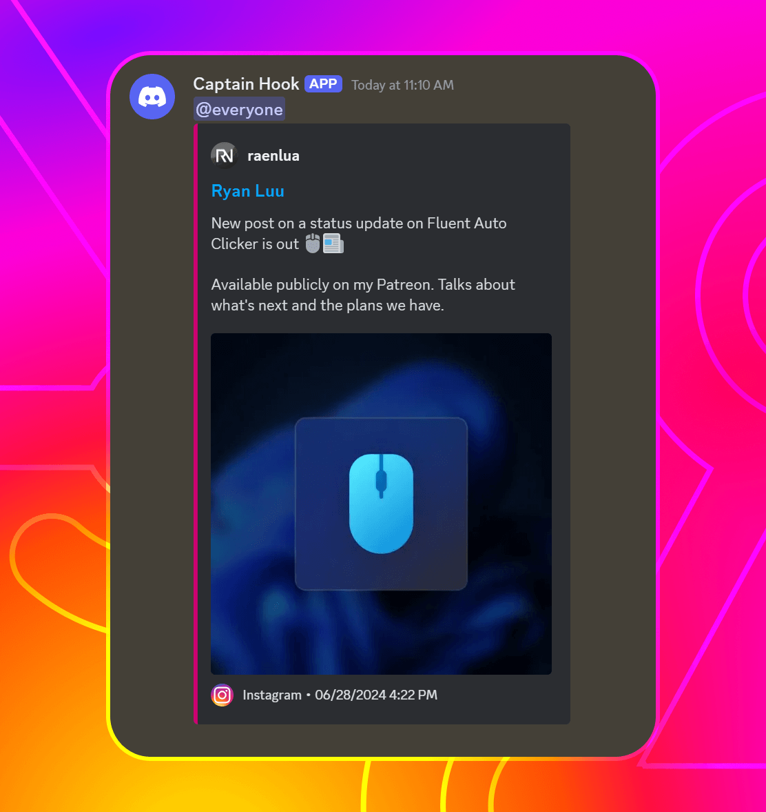

# InstaWebhooks

[](https://github.com/RyanLua/InstaWebhooks/actions/workflows/ci.yml) [](https://pypi.org/project/instawebhooks/#history) [](https://pypi.org/project/instawebhooks/) [](https://github.com/RyanLua/InstaWebhooks/blob/main/LICENSE.txt) [](https://github.com/psf/black) [](https://github.com/pylint-dev/pylint)


> [InstaWebhooks Documentation](https://github.com/RyanLua/InstaWebhooks/wiki)

Monitor Instagram accounts for new posts and send them to a Discord webhook.

* Works with **any Instagram account**, including private accounts if you are a follower
* Customizable **Discord embeds** for new posts and message contents including **mentions/pings**
* **User-definable refresh interval** for checking for new posts the second they are posted



## What is InstaWebhooks?

InstaWebhooks is a Python package CLI that allows you to monitor Instagram accounts for new posts and send them to a Discord webhook. It is designed to be simple to use and easy to set up, with a focus on customizability and ease of use.

Internally, InstaWebhooks uses [Instaloader](https://instaloader.github.io/) to fetch Instagram posts and [Discord Webhooks](https://discord.com/developers/docs/resources/webhook) to send messages to Discord via [requests](https://requests.readthedocs.io/en/latest/) which happens to be the same dependancy Instaloader uses. It uses [argparse](https://docs.python.org/3/library/argparse.html) for the CLI and [logging](https://docs.python.org/3/library/logging.html) for logging.

## Example

Below, InstaWebhooks is monitoring the Instagram account [`raenlua`](https://www.instagram.com/raenlua/) for new posts and sending them to a Discord webhook every 30 minutes and sends a message to Discord with the post URL and the owner's name.

```console
$ instawebhooks -i 1800 -c "New post from {owner_name}: {post_url}" raenlua https://discord.com/api/webhooks/0123456789/abcdefghijklmnopqrstuvwxyz
07/29/2024 10:02:10 PM - INFO - Starting InstaWebhooks...
07/29/2024 10:02:14 PM - INFO - InstaWebhooks started successfully.
07/29/2024 10:02:14 PM - INFO - Monitoring 'raenlua' every 1800 seconds on https://discord.com/api/webhooks/0123456789/abcdefghijklmnopqrstuvwxyz.
07/29/2024 10:02:18 PM - INFO - New post sent to Discord successfully.
```

What it looks like:


## Installation

InstaWebhooks is available on [PyPI](https://pypi.org/project/instawebhooks/), and can be installed using `pip`:

```
pip install instawebhooks
```

For more ways to install, see "[Installation](https://github.com/RyanLua/InstaWebhooks/wiki/Installation)."

## Usage


You can run `instawebhooks --help` to see the full list of options and arguments available.

The most basic usage of InstaWebhooks is to provide an Instagram account and a Discord webhook URL (replace `<INSTAGRAM_USERNAME>` and `<DISCORD_WEBHOOK_URL>`):

```
instawebhooks <INSTAGRAM_USERNAME> <DISCORD_WEBHOOK_URL>
```

For more about each option and argument, includig example templates, see "[Usage](https://github.com/RyanLua/InstaWebhooks/wiki/Usage)."

## Contributing

For contributions, see the [contributing guidelines](CONTRIBUTING.md).

This project supports [development containers](https://containers.dev/), allowing you to instantly setup your development environment. For more, read about [installing from dev container](https://github.com/RyanLua/InstaWebhooks/wiki/Installation#from-development-container)
