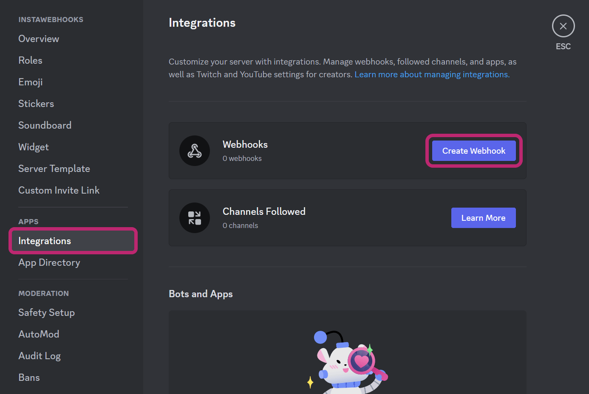
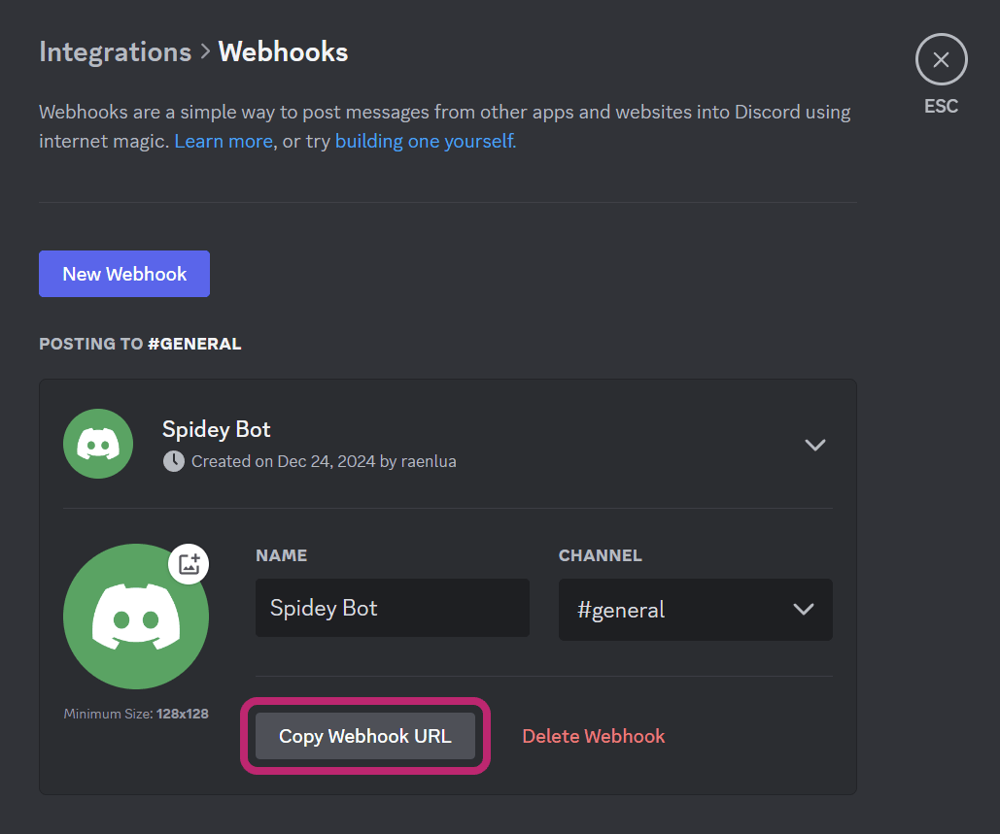
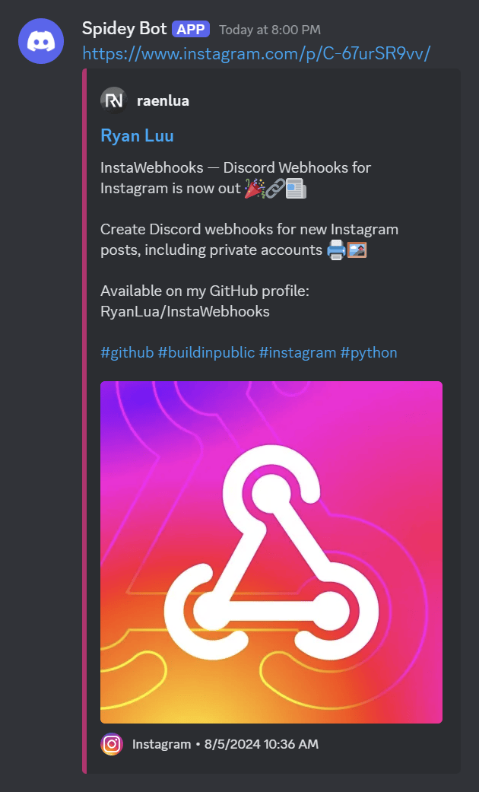

Getting Started
===============

Learn about getting started with InstaWebhooks to send new Instagram posts any Discord channel from scratch.

Installing InstaWebhooks
------------------------

With `Python <https://www.python.org/>`_ installed, install InstaWebhooks with `pip <https://pypi.org/project/pip/>`_:

.. code:: console

    $ pip install instawebhooks

Check that InstaWebhooks was installed correctly by seeing if it reports its version:

.. code:: console

    $ instawebhooks --version

Make sure that are on the `latest version of InstaWebhooks <https://pypi.org/project/instawebhooks/>`_.

For more ways to install InstaWebhooks, see the `installation guide <installation.html>`_.

Setting up Discord webhooks
---------------------------

To get your Discord webhook URL, you need the **Manage Webhooks** permission in the channel you want to send new Instagram posts to.

You can learn more about webhooks through the article, `Intro to Webhooks <https://support.discord.com/hc/en-us/articles/228383668>`_.

Creating your webhook
^^^^^^^^^^^^^^^^^^^^^

If your already have a webhook, you can skip this step.

#. Open **Server Settings**, then **Integrations**
#. Click the "**Create Webhook**" button

Now you can set the name, channel, and avatar for the webhook.

Getting the webhook URL
^^^^^^^^^^^^^^^^^^^^^^^

When you have your webhook made, click the "**Copy Webhook URL**" button to copy the URL to your clipboard.

The copied URL should look similar this:

.. code:: none

    https://discordapp.com/api/webhooks/0123456789/abcdefghijklmnopqrstuvwxyz

Setting up InstaWebhooks
------------------------

Now with the webhook URL and a Instagram account in mind, you can set up InstaWebhooks to send new Instagram posts to your Discord channel.

Replace ``<INSTAGRAM_USERNAME>`` with the username of the Instagram account you want to monitor and ``<DISCORD_WEBHOOK_URL>`` with the Discord webhook URL you copied earlier.

.. code:: console

    $ instawebhooks <INSTAGRAM_USERNAME> <DISCORD_WEBHOOK_URL>

It should look something like this:

.. code:: console

    $ instawebhooks raenlua https://discord.com/api/webhooks/0123456789/abcdefghijklmnopqrstuvwxyz

Now, whenever the Instagram account `@raenlua` posts a new photo, it will be sent to the Discord webhook.

For more information about using InstaWebhooks, see the `usage guide <usage.html>`_.

Setting up InstaWebhooks for multiple Instagram accounts or webhooks
--------------------------------------------------------------------

You can also set up InstaWebhooks to monitor multiple Instagram accounts or send new posts to multiple Discord webhooks.

Replace ``<INSTAGRAM_USERNAME_1>``, ``<INSTAGRAM_USERNAME_2>``, etc. with the usernames of the Instagram accounts you want to monitor and ``<DISCORD_WEBHOOK_URL_1>``, ``<DISCORD_WEBHOOK_URL_2>``, etc. with the Discord webhook URLs you want to send new posts to.

.. code:: console

    $ instawebhooks <INSTAGRAM_USERNAME_1> <INSTAGRAM_USERNAME_2> ... <DISCORD_WEBHOOK_URL_1> <DISCORD_WEBHOOK_URL_2> ...

It should look something like this:

.. code:: console

    $ instawebhooks raenlua anotheruser https://discord.com/api/webhooks/0123456789/abcdefghijklmnopqrstuvwxyz https://discord.com/api/webhooks/9876543210/zyxwvutsrqponmlkjihgfedcba

Now, whenever the Instagram accounts `@raenlua` or `@anotheruser` post a new photo, it will be sent to the specified Discord webhooks.
